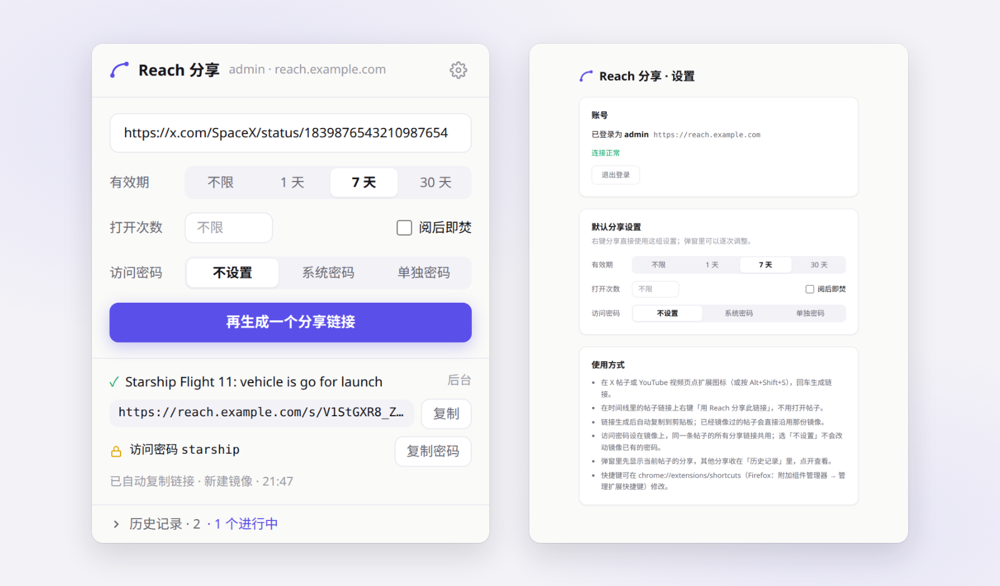

# Reach


**Reach turns out-of-reach posts into links anyone can open.**
Mirror an X or YouTube post — text, images, video, comments — into a private share link, publish your own articles, and watch how visitors actually read them.

[简体中文](./README.md) · English

Demo: **https://reach.fujioky.com**

---

## Related repositories

Reach is built from a few standalone repositories — see each repo for the full details:

- **[reach-upstream](https://github.com/fujioky/reach-upstream)** — a modification of [Agent Reach](https://github.com/Panniantong/agent-reach) that wraps it in an HTTP / MCP API for direct use by AI such as Claude and ChatGPT (that side is also **specially optimised for Xiaohongshu (xhs)**: post images are inlined so the AI can read the whole post), and normalises fetched content for Reach. **General-purpose**, not tied to Reach — Reach itself only mirrors X / YouTube. **Reach requires it** — a stock agent-reach install will not work; see its [README](https://github.com/fujioky/reach-upstream/blob/main/proxy/README.md).
- **[reach-dlproxy](https://github.com/fujioky/reach-dlproxy)** — a simple reverse-proxy server with access control and recursive resolution, used as Reach's video proxy / re-hosting channel. **General-purpose**.
- **[reach-browser-extension](https://github.com/fujioky/reach-browser-extension)** — a browser extension that turns the X post or YouTube video you're viewing into a Reach share link in one click (Chrome / Edge / Firefox). **Quick sharing**.

## Screenshots

| | |
| --- | --- |
|  Mirror page: X post with inline translation, video, engagement stats, curated comments |  Home page (light theme) |
|  Article page: table of contents, reading progress, cover and body |  Article archive at `/post` |
|  Create a mirror: paste a link → fetch preview → pick the comments to keep |  Mirror management: share links and visit stats per item |
|  New share link: expiry, total opens, unique visitors, burn after read |  Session replay sized to the visitor's viewport, with click heatmap |
|  Article management |  Media library: reference status, public sharing, cleanup of unreferenced files |
|  Cloudflare Turnstile gate on visitor pages |  Browser extension: one-click share from the popup (access control, password, history); sign in with the admin account on the options page |

## What it does

**Mirrors** — paste a post URL, get a self-hosted copy.

- Fetches X (Twitter) posts and YouTube videos through an upstream *Agent Reach* API, then normalises them into one content model: title, body, author, media, engagement stats, comments.
- Video is re-hosted: streamed through the app (`/api/proxy-video`), through an optional external reverse proxy (reference implementation: [fujioky/reach-dlproxy](https://github.com/fujioky/reach-dlproxy)), or uploaded to any S3-compatible bucket (Cloudflare R2, AWS S3, MinIO) and served from a CDN domain. Upstream streams are pulled in bounded chunks with automatic failover between hops.
- Share links (`/s/<token>`) can expire by time, by view count, or burn after a single read. Each mirror keeps a version history with preview-before-apply refresh and rollback.
- Subtitles: the best caption track is shown in-player; non-Chinese tracks are translated cue-by-cue via DeepL. Post text and comments get the same on-demand translation, cached in the database.

**Articles** — write your own posts in Markdown.

- Split-pane editor with live preview, drag-and-drop or paste uploads, and a site-wide media library.
- Images go to Vercel Blob; videos go to the S3 bucket via chunked multipart upload with per-part retry — both browser-direct, never through a serverless function.
- Remote import: paste image/video links (or a page URL) and the server transfers the media into your own storage. An optional LLM resolver finds the media URL on pages the hand-written rules cannot parse.
- Public permalinks (`/p/<slug>`), an archive page (`/post`), visitor comments with moderation, cover layouts, responsive WebP variants, and per-article password protection.

**Analytics** — self-built, no third-party script.

- Every visitor page is recorded with [rrweb](https://github.com/rrweb-io/rrweb) alongside structured events: views, dwell time per block, scroll depth, clicks, media plays, outbound links, video play/pause/seek/progress.
- Admin dashboards: overview trends, per-content detail, session replay sized to the visitor's viewport, and click heatmaps rendered over a real page snapshot.
- Ingest is unauthenticated but defended: body cap, origin check, schema validation, content existence check, and per-visitor rate limiting. Geo is resolved from IP and cached per address.

**Browser extension** — [fujioky/reach-browser-extension](https://github.com/fujioky/reach-browser-extension) (Chrome / Edge / Firefox).

- On an X post or YouTube video, click the icon, press the shortcut or right-click a post link to get a share link copied to the clipboard, with expiry, a view cap, burn-after-read and an access password.
- A post that is already mirrored gets a new link on that mirror instead of a second fetch; a new post goes through the same creation path as the admin wizard, keeping every comment.
- The extension signs in with the admin account and receives its own token (only the hash is stored); each one can be revoked under 系统 → 浏览器扩展. See [Browser extension](#browser-extension) below.

**Operations**

- Public status page (`/status`) with latency sparklines, fed by a daily cron sample and an admin health panel that probes the video proxy, S3 bucket, Agent Reach and DeepL.
- Cloudflare Turnstile gate for visitor pages, optional site-wide content password, PWA manifest and service worker, light/dark theme.

## Visit recording and session replay

When a visitor opens a mirror (`/s/<token>`) or an article (`/p/<slug>`), the page mounts a recorder (`app/_components/analytics/Recorder.tsx`); one page open is one session. It captures three kinds of data:

| Kind | What | Table |
| --- | --- | --- |
| DOM recording | [rrweb](https://github.com/rrweb-io/rrweb) full snapshot + incremental mutations; mouse moves sampled at 60 ms, scroll at 150 ms, media at 800 ms | `analytics_chunks` (jsonb batches ordered by `seq`) |
| Structured events | `view`, `dwell` (visible time per content block), `scroll` (max depth), `click` (page coords + document/viewport size), `media_click`, `media_play`, `outlink_click`, `video` (play / pause / seek / every 10 % of progress / fullscreen / ended / rate change) | `visit_events` |
| Session metadata | IP, User-Agent, screen and viewport size, DPR, language, referrer, country / region / city resolved from the IP and cached per address, rolling duration and event counters | `analytics_sessions` |

The recorder batches everything to `/api/analytics/ingest` every 5 seconds, earlier once the rrweb buffer passes 400 events; the final flush on page close uses `sendBeacon`. Failed batches stay in an outbox and are retried, session metadata is resent with every batch until acknowledged, and the ingest upsert is idempotent. Video events are captured at document level in the capture phase, so any `<video>` (Plyr included) is covered without instrumenting players.

What the admin sees:

- **`/admin/analytics/sessions`** — session list (time, content, region, device, duration, event count).
- **`/admin/analytics/session/<id>`** — replay with rrweb-player sized to the visitor's viewport, next to a behaviour timeline; videos inside the replay stay in sync with the recording.
- **`/admin/analytics/content/<id>/heatmap`** — click heatmap: a page snapshot is rendered from one real session's recording and every session's clicks for that content are drawn over it, bucketed by desktop / mobile viewport.
- **`/admin/analytics/content/<id>`** — per-content stats: trends, block dwell, scroll-depth funnel, video progress funnel and pause positions, click targets, media and outbound-link charts.

Things to know:

- Article media URLs carry a 6-hour signed token and the recording stores the URL the visitor saw; the replay API re-signs those tokens before serving (`lib/analytics/resign-media.ts`), so old sessions still show their images and videos without touching stored data.
- Ingest is unauthenticated but defended: body cap, origin check, schema validation, content existence check, per-visitor rate limit. Visitors are told apart by an HttpOnly `visitor_id` cookie.
- Inputs are **not** masked (`maskAllInputs: false`): text a visitor types into the comment form ends up in the recording.
- There is no switch to turn recording off and no automatic cleanup; recordings cascade-delete with their content item, so keep an eye on the size of `analytics_chunks`. Keep the `app/privacy-policy` page in line with what you actually collect.

## Browser extension

[fujioky/reach-browser-extension](https://github.com/fujioky/reach-browser-extension) folds "open the admin → paste the link → wait for the fetch → copy the share link" into one step: on an X post or YouTube video, get a share link straight away, copied to the clipboard. Chrome / Edge / Firefox.


**Install and connect**

1. Deploy this repository and run the migrations (`npm run db:migrate`; the extension needs the `api_tokens` table).
2. Download the zip from the extension's [Releases](https://github.com/fujioky/reach-browser-extension/releases/latest). Chrome / Edge: unzip it into a folder you keep, turn on Developer mode in `chrome://extensions` and "Load unpacked" that folder. Firefox: the zip is unsigned — load it temporarily from `about:debugging`, or have it signed on AMO as unlisted for everyday use.
3. Open the extension's options, enter the Reach address and sign in with the admin account. Reach checks the password and issues a token for this browser alone; the extension never stores the password. The admin page 系统 → 浏览器扩展 shows the Reach address to copy and lists every signed-in extension with its last use, each revocable.

**Use**

- On a post, click the extension icon or press `Alt+Shift+S`, then Enter; or right-click a post link on a timeline and choose "用 Reach 分享此链接" without opening it. The share finishes in the extension's background — close the popup whenever you like — and the link is copied when it is ready.
- Each share can set the link's expiry (none / 1 / 7 / 30 days), a view cap, burn-after-read, and the mirror's access password (site password / one of its own). Unique-visitor caps and an exact expiry are still edited on the link in the admin.
- The popup shows the current post's share first (twitter.com / x.com, youtu.be / watch links are recognised as the same post) and folds every other share into its history.

**API**

| Endpoint | Purpose |
| --- | --- |
| `POST /api/extension/session` | Trade the admin username and password for a token |
| `GET /api/extension/session` | Check that a token is still valid |
| `DELETE /api/extension/session` | Sign out, revoking the calling token |
| `POST /api/extension/share` | Post URL in, share link out, progress streamed as NDJSON |

Things to know:

- A post that already has a mirror (matched by platform + post ID) only gets a new share link on that mirror — no refetch; use "重新抓取" on the mirror in the admin to update it. A new post goes through the same creation code as the admin's create-mirror flow (`lib/mirror/create.ts`), keeping every comment, with the video transfer running after the response.
- An access password set while sharing is written to the **mirror** — the same setting as the password panel on the mirror's detail page — so the mirror's existing share links need it too. Leaving it unset keeps the mirror's current password; choosing the site password while none is configured is refused, rather than handing out a link that is not actually protected.
- `api_tokens` stores only each token's SHA-256. These endpoints allow CORS from any origin: they accept only the token (or, for sign-in, the password itself) and never read cookies, so no other site can ride the admin session. Like the admin login page, the sign-in endpoint is not rate-limited.
- The share endpoint streams because Chrome terminates an extension service worker whose fetch gets no response within 30 seconds, and fetching a new post often takes longer. A stream that ends without a `done` line is a failure.

## Stack

| Layer | Choice |
| --- | --- |
| Framework | Next.js 16 (App Router, Turbopack), React 19, TypeScript |
| Styling | Tailwind CSS 4, custom design tokens (`/design-system`) |
| Database | PostgreSQL via Drizzle ORM (Neon / Vercel Postgres in production) |
| Auth | Auth.js v5 with credentials provider, bcrypt, JWT sessions |
| Storage | Vercel Blob (images), any S3-compatible bucket (video) |
| Media | Plyr player, sharp for image variants, rrweb / rrweb-player for replay |
| Charts | Recharts |
| Tests | Vitest |

## Getting started

Prerequisites: Node.js 24, a PostgreSQL database, a Vercel Blob store, and an Agent Reach endpoint (see below).

```bash
git clone https://github.com/fujioky/reach.git
cd reach
npm install
cp .env.local.example .env.local   # fill in POSTGRES_URL, AUTH_SECRET, BLOB_READ_WRITE_TOKEN, AGENT_REACH_*
npm run db:migrate
npm run dev
```

Open `http://localhost:3000/admin/login`. When the users table is empty the login page becomes a one-time setup form that creates the single admin account. Everything else — video proxy, S3 bucket, DeepL key, AI parser, content password — is configured at runtime under **Admin → 系统设置**.

Run the test suite with `npm test`.

### Environment variables

| Variable | Required | Purpose |
| --- | --- | --- |
| `POSTGRES_URL` | yes | Postgres connection string (also used by `drizzle-kit`) |
| `AUTH_SECRET` | yes | Auth.js secret (`openssl rand -base64 32`) |
| `BLOB_READ_WRITE_TOKEN` | yes | Vercel Blob token for images and avatars |
| `AGENT_REACH_BASE_URL` | yes* | Upstream Agent Reach base URL |
| `AGENT_REACH_PWD` | yes* | Upstream Agent Reach password |
| `NEXT_PUBLIC_SITE_URL` | no | Canonical origin for share links, OpenGraph and the analytics origin check; defaults to the Vercel production URL |
| `CRON_SECRET` | no | Protects `/api/cron/*`; Vercel sends it automatically for scheduled jobs |
| `AI_PARSER_API_KEY` | no | Key for the optional LLM media resolver |
| `TURNSTILE_SITE_KEY` / `TURNSTILE_SECRET_KEY` | no | Enable the Cloudflare Turnstile gate on visitor pages; leave both empty to disable |

\* Can be set in the admin settings instead; environment values take precedence.

### Agent Reach

Reach does not scrape platforms itself. It calls an HTTP service that wraps the [Agent Reach](https://github.com/Panniantong/agent-reach) toolchain. A stock upstream install is **not** enough: upstream is a local capability layer for AI agents with no wrapping API. Deploy the proxy from **[fujioky/reach-upstream](https://github.com/fujioky/reach-upstream)** (`proxy/`, see its [README](https://github.com/fujioky/reach-upstream/blob/main/proxy/README.md)) instead. It adds the custom X/Twitter and YouTube parsing Reach depends on — one normalised item, every progressive YouTube video source, subtitles as timed VTT, threaded comments, structured error kinds — and exposes the toolchain publicly through this endpoint and an MCP server with OAuth (usable from ChatGPT / Claude connectors):

```
GET {base}/healthz                                   → { "ok": true, ... }
GET {base}/http/?platform=x|youtube&query=<url>&pwd=<pwd>
                                                     → { "ok": true, "item": { ... }, "errors": [] }
```

`item` carries the post text, author, media (with all yt-dlp video sources for YouTube), engagement stats, comments, and optional `transcript` / `transcript_lang` / `transcript_vtt` fields. The adapters in `lib/fetcher/platforms/` normalise it; error kinds map to `lib/fetcher/errors.ts`. Rate limits (429) and network errors are retried with exponential backoff.

## Deploying to Vercel

1. Create a Vercel project from this repository (framework preset: Next.js, Node 24).
2. Attach a Postgres database (Neon via the Vercel marketplace works out of the box) and a Blob store; Vercel injects `POSTGRES_URL` and `BLOB_READ_WRITE_TOKEN`.
3. Add `AUTH_SECRET`, `AGENT_REACH_BASE_URL`, `AGENT_REACH_PWD`, and optionally `NEXT_PUBLIC_SITE_URL` and the Turnstile keys.
4. Run the migrations once against the production database: `POSTGRES_URL=... npm run db:migrate`.
5. Deploy. `vercel.json` already schedules the daily health sample cron.
6. Visit `/admin/login` to create the admin account, then fill in the video proxy / storage settings.

The `vercel` CLI uploads the working directory rather than a git commit; `.vercelignore` keeps local caches and media out of the upload.

## Project layout

```
app/
  admin/(shell)/      admin UI: mirrors, shares, articles, media, analytics, settings
  admin/login/        login + first-run setup
  api/                route handlers: fetch, proxy-video, article-media, analytics ingest, health, cron…
  api/extension/      browser extension API: sign-in for a token, streaming quick share
  s/[token]/          mirror visitor page
  p/[slug]/, post/    article page and archive
  status/             public status page
lib/
  fetcher/            Agent Reach client + platform adapters (X, YouTube), post URL parsing
  mirror/             mirror creation (shared by the wizard and the extension), quick share, refresh, versions
  video/              chunked upstream fetch, proxy failover, playback URL resolution
  storage/, blob/     S3 multipart + presign, Vercel Blob helpers
  article/            markdown, media library, remote import (SSRF-guarded), tokens
  analytics/          queries, geo lookup, replay media re-signing
  access/, content/   share access control, password gate
  auth/               admin credential check, extension tokens
  health/, settings/  health probes, typed app_settings accessor
drizzle/migrations/   SQL migrations (drizzle-kit)
```

`AGENTS.md` collects the non-obvious behaviours and pitfalls that matter when changing the code; `docs/article-publishing.md` documents the article pipeline in depth.
